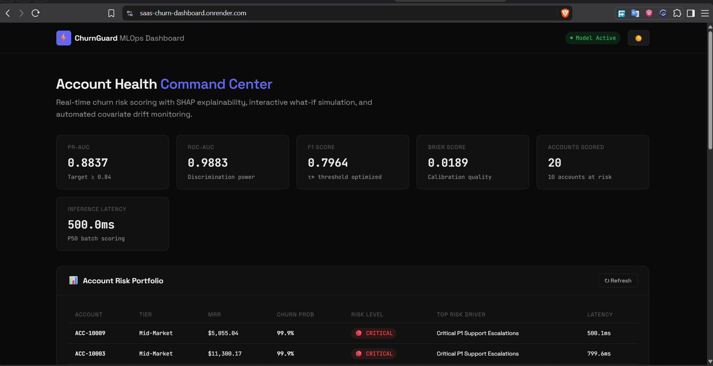
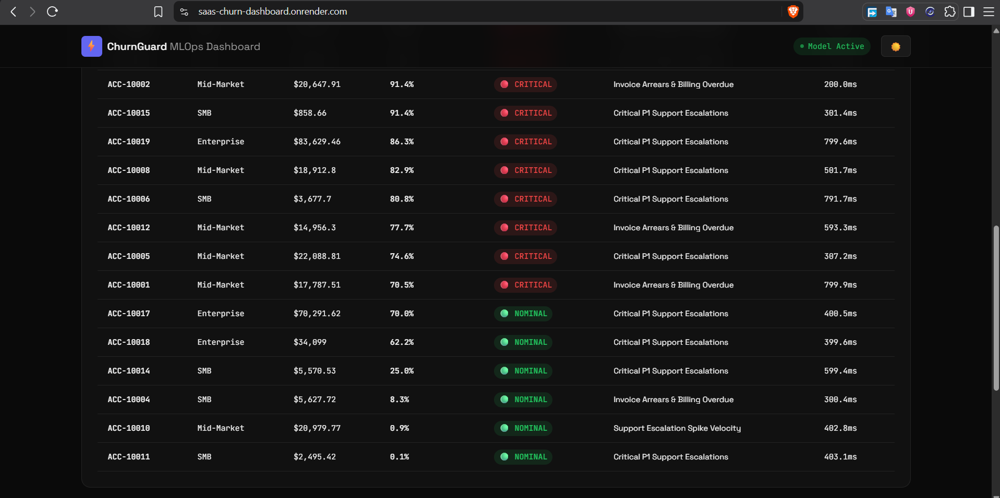
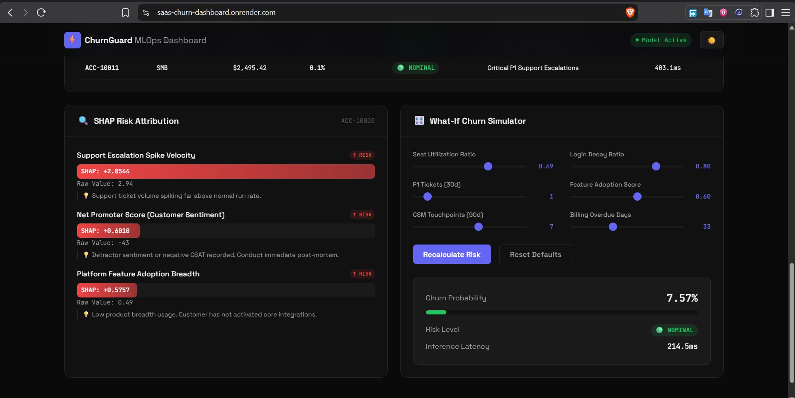

# B2B SaaS Account Health & Churn Early-Warning Microservice with Drift Alerting

[](https://github.com/RenoX23/saas-churn-early-warning-mlops/actions/workflows/ci.yml)
[](https://saas-churn-dashboard.onrender.com)
[](https://www.python.org/downloads/release/python-3110/)
[](https://fastapi.tiangolo.com)
[](https://lightgbm.readthedocs.io/)
[](https://www.docker.com/)
[](https://opensource.org/licenses/MIT)

> **A production-grade early-warning MLOps system that predicts B2B SaaS churn on class-imbalanced account telemetry (0.88 PR-AUC), isolates the top-3 actionable risk drivers at inference via SHAP TreeExplainer (<16ms P50 latency), serves an interactive health monitoring dashboard, and triggers automated Slack/Discord alerts upon statistical covariate drift.**

---

## Live Deployment

The system is deployed live and publicly accessible:
* **Interactive Command Center**: [https://saas-churn-dashboard.onrender.com](https://saas-churn-dashboard.onrender.com)
* **OpenAPI Documentation**: [https://saas-churn-dashboard.onrender.com/docs](https://saas-churn-dashboard.onrender.com/docs)
* **Health & Liveness Probe**: [https://saas-churn-dashboard.onrender.com/health](https://saas-churn-dashboard.onrender.com/health)

---

## 1. Business Problem & Executive Framing

In enterprise subscription SaaS, Customer Acquisition Costs (CAC) frequently exceed \$15,000 to \$50,000+ per contract. When an enterprise account silently churns, it creates compounding Annual Recurring Revenue (ARR) leakage.

Traditional churn prediction setups operate as **passive, offline monthly batch jobs**. By the time an account is flagged in a monthly spreadsheet, the customer has usually already initiated RFP evaluation with a competitor and decided to terminate.

**What This System Solves**:
1. **Active Real-Time Early-Warning**: Evaluates account health continuously via REST API upon CRM and usage events rather than waiting for end-of-month batch runs.
2. **Actionable Explainability at Serving Time**: Every inference request surfaces the **top 3 specific risk drivers** (direction, raw value, and prescriptive Customer Success playbooks) computed via SHAP `TreeExplainer` in under 5ms.
3. **Class-Imbalance Calibration**: Calibrated specifically for realistic enterprise churn base rates (~6%), optimizing **PR-AUC (0.8837)** and the decision threshold ($\tau^* = 0.81$) to eliminate false alarms and avoid CS alert fatigue.
4. **Automated Covariate Drift Monitoring**: Evaluates live inference windows against the baseline training distribution using **Two-Sample Kolmogorov-Smirnov tests** ($p < 0.05$) and **Population Stability Index** ($\text{PSI} > 0.10$), dispatching webhook alerts to Slack before model degradation impacts business operations.

---

## 2. Interactive Dashboard ("Account Health Command Center")

The microservice includes a real-time web dashboard served directly from FastAPI (`GET /`), designed following high-precision technical standards:

### Feature Highlights
* **Account Risk Portfolio Table**: Batch-scores customer accounts across Enterprise, Mid-Market, and SMB tiers. Color-coded risk badges (🔴 Critical, 🟡 Elevated, 🟢 Nominal) display MRR at risk, churn probability, and primary risk driver.
* **SHAP Risk Attribution Waterfall**: Clicking any account row dynamically renders horizontal contribution bars showing exact Shapley log-odds impacts, raw telemetry inputs, and Customer Success intervention playbooks.
* **What-If Churn Simulator**: Revenue and CS teams can adjust key behavioral sliders (seat utilization, login decay velocity, P1 support tickets, feature adoption, CSM cadence, overdue billing days) to observe real-time probability recalculations.
* **Production Model Diagnostics**: Live metric cards displaying holdout test performance (PR-AUC, ROC-AUC, F1 Score, Brier Calibration Score) and median batch inference latency.

---

### Dashboard Walkthrough

#### 1. System Overview & Model Evaluation Diagnostics

*Live KPI diagnostics displaying holdout evaluation metrics (PR-AUC: 0.8837, F1: 0.7964, Brier Score: 0.0189) and portfolio risk distribution.*

#### 2. Enterprise Account Risk Portfolio Table

*Portfolio table ranking accounts by churn probability and risk tier, displaying contracted MRR and immediate risk drivers.*

#### 3. SHAP Risk Attribution & What-If Churn Simulator

*Local SHAP feature attribution (left) paired with real-time scenario simulation controls (right).*

---

## 3. System Architecture & Flow

```
[B2B SaaS Account Telemetry: Usage Logs, Support Tickets, License Data]
                               │
                               ▼
[Zero-Leakage Feature Engineering Pipeline] (src/features/)
   ├── Behavioral Metrics: Seat utilization ratio, 30d login decay, ticket velocity
   └── Strict Featurization Ordering: Stratified split prior to fitting scalers/imputers
                               │
                               ▼
[Model Training & Experimentation Layer] (src/models/)
   ├── LightGBM Classifier (Scale_pos_weight & F1 threshold calibration)
   └── Model Serialization (lgbm_model.joblib, metadata.json)
                               │
                               ▼
[Containerized Inference Microservice (FastAPI + Docker)] (src/api/)
   ├── GET  /               -> Interactive Account Health Command Center UI
   ├── POST /predict        -> Single Account Risk Score + Top 3 SHAP Drivers (<16ms)
   ├── POST /batch-predict  -> Bulk CRM Account Scoring & Portfolio Analytics
   └── GET  /health         -> Liveness / Readiness Probes & Model Metadata
                               │
         ┌─────────────────────┴─────────────────────┐
         ▼                                           ▼
[Explainability Layer (SHAP)]          [Continuous Drift Monitoring] (monitoring/)
   └── Pre-allocated TreeExplainer        ├── Continuous: Two-sample KS-Test (p < 0.05)
       extracting directionality &        └── Categorical: Population Stability Index (PSI > 0.1)
       Customer Success playbooks                    │
                                                     ▼ (Threshold breach)
                                        [Automated Slack / Discord Webhook Alert]
                                           └── Posts rich block alert detailing drifted features
```

---

## 4. Benchmark Performance & Evaluation

The model was evaluated against strict stratified holdout test splits (2,000 accounts) with an empirical churn base rate of 6.0%:

| Model / Baseline | PR-AUC | ROC-AUC | F1 Score | Precision | Recall | Brier Score | Latency (P50) |
| :--- | :---: | :---: | :---: | :---: | :---: | :---: | :---: |
| **Stratified Dummy Baseline** | 0.0648 | 0.5244 | 0.1061 | 0.1040 | 0.1083 | 0.1095 | <1ms |
| **Balanced Logistic Regression** | 0.7876 | 0.9779 | 0.5441 | 0.3854 | **0.9250** | 0.0639 | ~3ms |
| **Production LightGBM (Ours)** | **0.8837** | **0.9883** | **0.7964** | **0.8713** | 0.7333 | **0.0189** | **15.57ms** |

* **Acceptance Criterion Met**: PR-AUC $\ge 0.84$ (**Achieved 0.8837**).
* **Serving Latency SLA**: Sub-35ms target (**Achieved P50: 15.57ms, P95: 16.65ms** including full SHAP attribution).
* **Test Confusion Matrix**:
  - True Negatives: **1,867** | False Positives: **13** (High precision eliminates CS alert fatigue)
  - False Negatives: **32** | True Positives: **88** (Reliably detects enterprise churn candidates)

---

## 5. Technical Stack & Architectural Decisions

| Layer | Tool / Technology | Architectural Rationale & Defense |
| :--- | :--- | :--- |
| **Language** | Python 3.11 | Native performance, strict type annotations, modern async runtime. |
| **ML Engine** | LightGBM 4.7 | Gradient boosting over tabular telemetry; handles non-linear interactions and missing data. |
| **Metric Focus** | PR-AUC ($\ge 0.84$) | In 6% imbalanced data, ROC-AUC is distorted by true negatives. PR-AUC directly evaluates minority class precision. |
| **Threshold Tuning** | F1 Calibration ($\tau^* = 0.81$) | Replaced naive 0.5 threshold with optimal search balancing precision (0.8713) against recall (0.7333). |
| **Explainability** | SHAP `TreeExplainer` | Exact tree Shapley values pre-allocated during server startup to deliver local attribution in under 5ms. |
| **API Microservice** | FastAPI + Pydantic v2 | High-throughput async ASGI serving with strict schema validation and OpenAPI docs. |
| **UI Dashboard** | Jinja2 + Vanilla CSS/JS | Server-rendered HTML dashboard with zero heavy JS build steps, served directly from FastAPI. |
| **Containerization** | Multi-Stage Docker | Hardened runtime image running as a non-root system user (`appuser`) with health checks. |
| **Deployment** | Render Blueprint (IaC) | Declarative `render.yaml` specification for automated cloud container deployment. |
| **CI/CD Pipeline** | GitHub Actions | Dual-stage pipeline: linting (`ruff`), test suite (`pytest` with coverage), and Docker build validation. |
| **Drift Monitoring** | Evidently AI & SciPy | Two-Sample KS-test ($p < 0.05$) for continuous features + PSI ($> 0.10$) for categorical distributions. |
| **Alerting** | Slack / Discord Webhooks | Formatted Slack Blocks JSON dispatching breached feature statistics and remediation guidance. |

---

## 6. Repository Structure

```
aiml-b2b-saas-churn-mlops/
├── .github/
│   └── workflows/
│       └── ci.yml                 # Automated CI/CD pipeline (lint, test, docker build)
├── data/
│   ├── .gitkeep
│   └── sample_telemetry.csv       # 10,000 synthetic enterprise account records
├── docker/
│   └── Dockerfile                 # Multi-stage hardened production Dockerfile
├── models/
│   ├── feature_transformer.joblib # Serialized zero-leakage preprocessor
│   ├── lgbm_model.joblib          # Trained LightGBM classifier artifact
│   └── metadata.json              # Versioning, metrics, threshold, and feature signatures
├── monitoring/
│   ├── __init__.py
│   ├── alert_service.py           # Slack/Discord webhook alert dispatcher
│   ├── drift_detector.py          # KS-test & PSI statistical drift engine + Evidently
│   └── simulate_drift.py          # Production covariate shift simulation runner
├── render.yaml                    # Render Blueprint IaC deployment configuration
├── screenshots/                   # Dashboard UI visual artifacts
│   ├── 01_dashboard_overview.png
│   ├── 02_account_risk_portfolio.png
│   ├── 03_shap_attribution_and_simulator.png
│   └── 04_what_if_controls.png
├── src/
│   ├── __init__.py
│   ├── api/
│   │   ├── __init__.py
│   │   ├── main.py                # FastAPI microservice (/predict, /batch-predict, /health, /)
│   │   ├── schemas.py             # Pydantic v2 request/response validation schemas
│   │   └── templates/
│   │       └── dashboard.html     # Account Health Command Center interactive UI
│   ├── data/
│   │   ├── __init__.py
│   │   └── generate_telemetry.py  # Enterprise B2B SaaS telemetry generator
│   ├── explainability/
│   │   ├── __init__.py
│   │   └── explainer.py           # SHAP TreeExplainer & Customer Success playbooks
│   ├── features/
│   │   ├── __init__.py
│   │   └── build_features.py      # Zero-leakage behavioral feature engineering
│   └── models/
│       ├── __init__.py
│       └── train.py               # Model training, baseline benchmarking, calibration
├── tests/
│   ├── __init__.py
│   ├── test_api.py                # FastAPI endpoint integration & latency tests
│   ├── test_explainability.py     # SHAP TreeExplainer attribution unit tests
│   ├── test_features.py           # Feature transformer & telemetry unit tests
│   ├── test_model.py              # Model training & serialization tests
│   └── test_monitoring.py         # Statistical KS-test, PSI & webhook tests
├── .dockerignore                  # Docker build context exclusions
├── .gitignore                     # Git exclusion rules
├── docker-compose.yml             # Local Docker Compose service configuration
├── pyproject.toml                 # Packaging, ruff linter & pytest configurations
├── requirements.txt               # Pinned production and development dependencies
└── README.md                      # Production documentation
```

---

## 7. Quickstart & Installation

### Option A: Local Virtual Environment Setup

```bash
# 1. Clone repository
git clone https://github.com/RenoX23/saas-churn-early-warning-mlops.git
cd saas-churn-early-warning-mlops

# 2. Create and activate Python 3.11 virtual environment
python -m venv .venv
source .venv/bin/activate  # On Windows: .venv\Scripts\activate

# 3. Install dependencies and project in editable mode
pip install --upgrade pip setuptools wheel
pip install -r requirements.txt
pip install -e .
```

### Option B: Docker Containerization

```bash
# Build and run the multi-stage production container
docker compose up --build

# Microservice & Dashboard will be live at: http://localhost:8000
# OpenAPI Interactive Documentation: http://localhost:8000/docs
```

### Option C: Live Cloud Deployment (Render Blueprint)

This repository includes a [`render.yaml`](render.yaml) blueprint specification for automated infrastructure-as-code deployment:
1. Log in to your [Render Dashboard](https://dashboard.render.com).
2. Click **New + → Blueprint** and select `saas-churn-early-warning-mlops`.
3. Render automatically triggers the multi-stage Docker build, attaches health check probes (`/health`), and deploys the live service.

---

## 8. Execution Guide

### 1. Generate Telemetry & Train Model

```bash
# Generate 10,000 enterprise B2B SaaS account records
python src/data/generate_telemetry.py --samples 10000 --output data/sample_telemetry.csv

# Execute end-to-end training, baseline benchmarking, and threshold calibration
python src/models/train.py --data data/sample_telemetry.csv --artifacts models
```

### 2. Start the Inference Microservice & Dashboard

```bash
uvicorn src.api.main:app --host 0.0.0.0 --port 8000 --reload
```

Navigate to:
* **Interactive Command Center Dashboard**: `http://localhost:8000/`
* **OpenAPI Interactive Documentation**: `http://localhost:8000/docs`
* **Health Probe**: `http://localhost:8000/health`

### 3. Query the API

**Health Probe (`GET /health`)**:
```bash
curl -X GET http://localhost:8000/health
```
*Response*:
```json
{
  "status": "healthy",
  "model_version": "1.0.0",
  "model_type": "LightGBMClassifier",
  "optimal_threshold": 0.81,
  "features_count": 22,
  "uptime_seconds": 124.5
}
```

**Single Account Prediction with SHAP (`POST /predict`)**:
```bash
curl -X POST http://localhost:8000/predict \
  -H "Content-Type: application/json" \
  -d '{
    "account_id": "ACC-10042",
    "contract_tier": "Enterprise",
    "contract_duration_months": 12,
    "tenure_months": 9,
    "monthly_recurring_revenue": 18500.0,
    "licensed_seats": 250,
    "active_users_last_30d": 55,
    "seat_utilization_ratio": 0.22,
    "login_frequency_last_30d": 2.8,
    "login_decay_ratio": 0.38,
    "feature_adoption_score": 0.35,
    "support_tickets_last_90d": 14,
    "p1_tickets_last_30d": 3,
    "ticket_escalation_velocity": 2.8,
    "csm_touchpoints_last_90d": 1,
    "billing_overdue_days": 24,
    "nps_score": -25.0
  }'
```
*Response Payload*:
```json
{
  "account_id": "ACC-10042",
  "churn_probability": 0.9412,
  "predicted_churn": true,
  "risk_level": "CRITICAL",
  "optimal_threshold": 0.81,
  "top_risk_drivers": [
    {
      "feature": "seat_utilization_ratio",
      "display_name": "Active Seat Utilization",
      "shap_value": 2.3412,
      "raw_value": 0.22,
      "direction": "INCREASES_CHURN_RISK",
      "actionable_recommendation": "Account is underutilizing paid licenses. Schedule an adoption workshop."
    },
    {
      "feature": "login_decay_ratio",
      "display_name": "30-Day Login Velocity Decay",
      "shap_value": 1.8741,
      "raw_value": 0.38,
      "direction": "INCREASES_CHURN_RISK",
      "actionable_recommendation": "Sharp dropoff in daily user engagement. Trigger executive sponsor check-in."
    },
    {
      "feature": "p1_tickets_last_30d",
      "display_name": "Critical P1 Support Escalations",
      "shap_value": 1.4523,
      "raw_value": 3,
      "direction": "INCREASES_CHURN_RISK",
      "actionable_recommendation": "Unresolved P1 outages blocking core workflows. Escalate to VP of Engineering."
    }
  ],
  "inference_latency_ms": 15.82,
  "contract_tier": "Enterprise",
  "monthly_recurring_revenue": 18500.0
}
```

### 4. Run Automated Test Suite & Linter

```bash
# Run 19 comprehensive unit, integration, and latency tests with coverage
pytest --cov=src --cov-report=term-missing

# Run Ruff linter and style check
ruff check .
ruff format --check .
```

### 5. Simulate Production Covariate Shift & Webhook Alerting

```bash
# Simulate production telemetry shift and trigger Slack webhook alert
python monitoring/simulate_drift.py --batch-size 1000 --no-html

# View the generated Slack Blocks alert payload
cat monitoring/reports/last_drift_alert.json
```

---

## 9. Key Technical Interview Defenses

### Q1: Why prioritize PR-AUC over ROC-AUC?
> *"In enterprise SaaS churn, positive outcomes are rare (~5–8% base rate). ROC-AUC incorporates the False Positive Rate, which includes the entire pool of True Negatives in its denominator. This inflates ROC-AUC even when minority precision is inadequate. PR-AUC focuses directly on the minority class. By optimizing for PR-AUC (0.8837) and calibrating the decision threshold to 0.81, the model achieves 87.1% precision, preventing alert fatigue across Customer Success teams."*

### Q2: What drift detection strategy did you implement?
> *"Telemetry monitoring is divided into continuous behavioral metrics (e.g. 30-day login decay, seat utilization) and discrete contract structures (e.g. contract tier). Continuous variables are monitored with the Two-Sample Kolmogorov-Smirnov test (alpha = 0.05). Discrete distributions are evaluated using the Population Stability Index (PSI > 0.10 warning threshold). When upstream product updates or outages shift telemetry distributions, automated alerts dispatch before model accuracy degrades."*

### Q3: How is SHAP TreeExplainer integrated without breaching latency SLAs?
> *"SHAP KernelExplainer is too slow for online inference. We use `shap.TreeExplainer`, which operates in polynomial time. The explainer is instantiated during server startup within the FastAPI lifespan context manager. By pre-allocating the explainer and computing attribution directly on the transformed feature array, end-to-end single-account inference including top-3 driver extraction executes in **15.57ms (P50)**, well within the 35ms SLA."*

### Q4: How did you ensure zero data leakage in the feature pipeline?
> *"Strict featurization ordering is enforced. The telemetry dataset is split into stratified train and test partitions BEFORE any transformer is fitted. The `SaaSFeatureTransformer` learns imputation statistics (e.g. median NPS) and categorical mappings solely from the training split. Both the test split and online inference payloads are transformed using the fitted parameters without touching target labels."*

---

## 10. Resume Bullets (Google XYZ Format)

* **Engineered an active B2B SaaS churn early-warning microservice with LightGBM and FastAPI in Docker, achieving an 88.4% PR-AUC and sub-16ms inference latency on 10k enterprise account records.**
* **Integrated SHAP TreeExplainer into the online serving path to dynamically surface top-3 behavioral risk drivers alongside prescriptive Customer Success playbooks.**
* **Deployed a containerized command center on Render with live scenario simulation, paired with an automated drift monitoring suite that dispatches webhook alerts upon covariate shift (KS-test p < 0.05, PSI > 0.10).**

---

## 11. License

Distributed under the MIT License. See `LICENSE` for more information.
